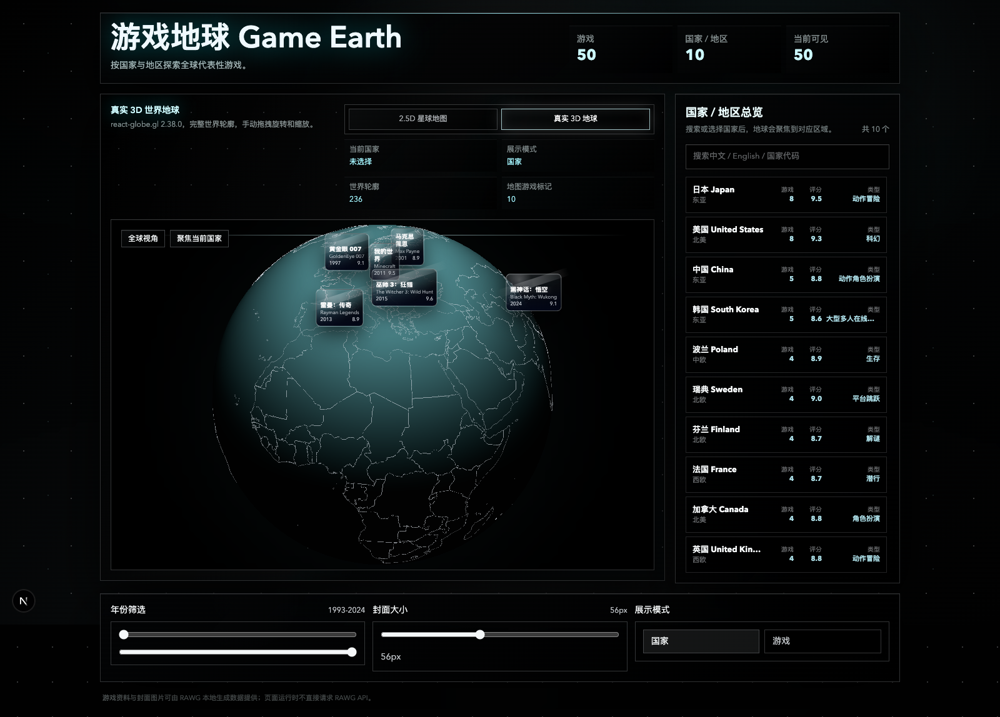

# Ludic Atlas / 游戏星图

Ludic Atlas is a game culture exploration project with two entrances: Earth Explorer for 3D globe exploration and Game Chronicle for timeline archive browsing.

游戏星图是一个全球游戏文化探索项目，包含 3D 地球探索和游戏编年馆两个入口。

## Preview / 项目预览



## Overview / 项目简介

中文：

游戏星图提供两个入口：用户可以在 Earth Explorer 中按国家和地区浏览代表性游戏，也可以在 Game Chronicle / 游戏编年馆中沿时间轴查看高分游戏馆藏，查看游戏封面、评分、类型、发行年份、开发商、发行商和简介。

English:

Ludic Atlas is an interactive game culture exploration project. Users can discover representative games by country or region on a 3D globe, or browse a time-based game archive with cover images, ratings, genres, release years, developers, publishers, and descriptions.

## Features / 核心功能

- Ludic Atlas landing hub / 游戏星图总入口
- 真实 3D 地球视图 / Real 3D globe view
- Game Chronicle 横向时间轴与年份抽屉 / Game Chronicle horizontal timeline and year drawer
- 国家边界展示 / Country border rendering
- 国家搜索与快速跳转 / Country search and quick navigation
- 按国家浏览代表性游戏 / Representative games by country or region
- 游戏封面与详情展示 / Game cover and detail display
- 年份筛选 / Release year filtering
- 右侧国家详情面板 / Right-side country detail panel
- RAWG 本地静态数据生成管线 / Local static RAWG data generation pipeline
- 中文优先、英文辅助的信息展示 / Chinese-first UI copy with English support

## Tech Stack / 技术栈

- Next.js
- TypeScript
- Tailwind CSS
- React
- react-globe.gl
- three.js
- RAWG API data generation script

## Project Structure / 项目结构

- `src/app/`: Next.js App Router page entry, root layout, and global styles.
- `src/components/`: Main product shell and shared UI components.
- `src/components/globe/`: 3D globe, country layer, marker layer, tooltip, and fallback map view.
- `src/components/panels/`: Country list, country detail, right panel, and game detail card.
- `src/components/controls/`: Year filter, cover size control, and view mode controls.
- `src/data/`: Country data, generated game data entrypoint, and stable mock fallback data.
- `src/lib/`: Filtering, statistics, localization, search, and geographic helpers.
- `src/types/`: Shared TypeScript data types.
- `scripts/`: Local RAWG seed list and static data generation script.
- `docs/`: Project planning, architecture, schema, task log, and README preview assets.

## Getting Started / 本地运行

Install dependencies and start the development server:

```bash
npm install
npm run dev
```

Open:

```text
http://localhost:3000
```

## RAWG Data Pipeline / RAWG 数据生成

中文：

本项目不会在浏览器端直接请求 RAWG API。数据通过本地脚本生成静态数据文件。

English:

This project does not call the RAWG API from the browser. RAWG data is generated locally into a static TypeScript data file.

Create a local environment file:

```bash
touch .env.local
```

Add your RAWG API key:

```bash
RAWG_API_KEY=your_rawg_api_key
```

Generate static game data:

```bash
npm run data:rawg
```

Cache RAWG cover images locally:

```bash
npm run data:covers
```

If RAWG API cannot be reached directly from your local network, set proxy environment variables before running the script:

```bash
export HTTPS_PROXY=http://127.0.0.1:7890
export HTTP_PROXY=http://127.0.0.1:7890
export ALL_PROXY=http://127.0.0.1:7890
npm run data:rawg
```

Notes:

- `.env.local` is ignored by Git and should not be committed.
- API keys must not be written into source code, documentation, or generated build output.
- Generated game data is written to `src/data/games.generated.ts`.
- Cached RAWG covers are written to `public/covers/rawg/`, and generated `coverImage` values are rewritten to `/covers/rawg/...`.
- The RAWG script reads `HTTPS_PROXY`, `HTTP_PROXY`, or `ALL_PROXY` through `undici` when a local proxy is needed.
- The RAWG cover cache script also supports proxy environment variables, but does not read `.env.local` and does not require a RAWG API key.

## Data Source & Attribution / 数据来源与署名

- Game metadata and cover images can be generated from RAWG API.
- This project uses RAWG data for personal, educational, and portfolio purposes.
- Please follow RAWG API Terms of Use when using generated data.

中文：

本项目的部分游戏数据和封面图可通过 RAWG API 生成，仅用于个人学习、作品集展示和非商业用途。使用时请遵守 RAWG API 使用条款。

## Scripts / 常用命令

```bash
npm run dev
npm run build
npm run lint
npm run typecheck
npm run data:rawg
```

## Current Status / 当前状态

- 当前是 MVP / prototype。
- 3D 地球和国家探索功能已经具备。
- 数据生成管线已具备。
- 后续仍需继续优化 3D 性能、封面资源、国家交互和视觉细节。

## Roadmap / 后续计划

- 优化 3D 地球性能 / Improve 3D globe performance
- 增强国家 hover 与选中效果 / Enhance country hover and selected states
- 增加更多国家和游戏数据 / Add more countries and representative games
- 优化游戏封面展示 / Improve game cover presentation
- 增加国家详情大面板 / Add a larger country detail panel
- 提升移动端体验 / Improve mobile experience
- 后续可考虑 IGDB 或其他更高质量封面源 / Consider IGDB or other higher-quality cover sources later

## Repository / 仓库地址

[https://github.com/ChestnutleeEd/game-earth](https://github.com/ChestnutleeEd/game-earth)

## License / 许可证

No license has been selected yet.
