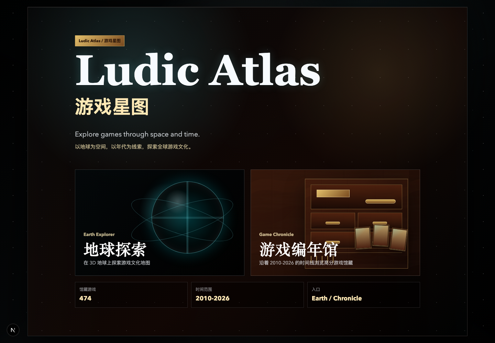
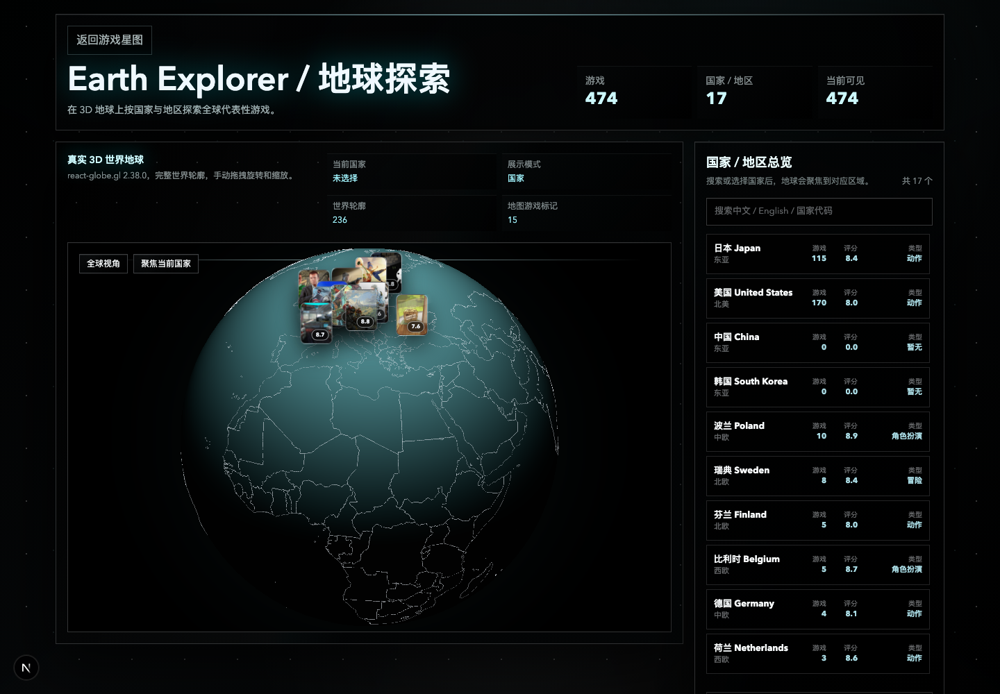
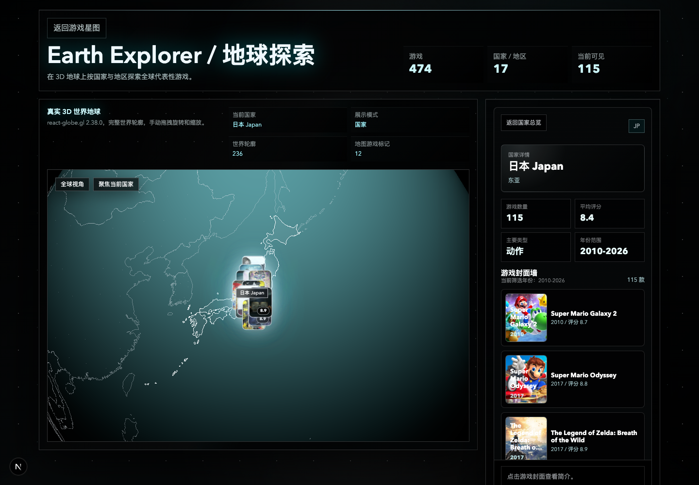
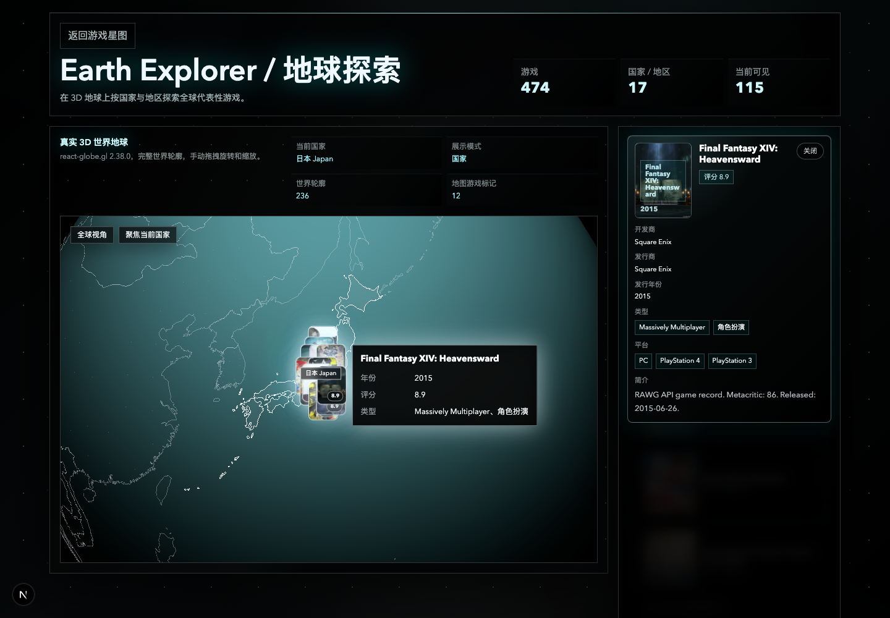
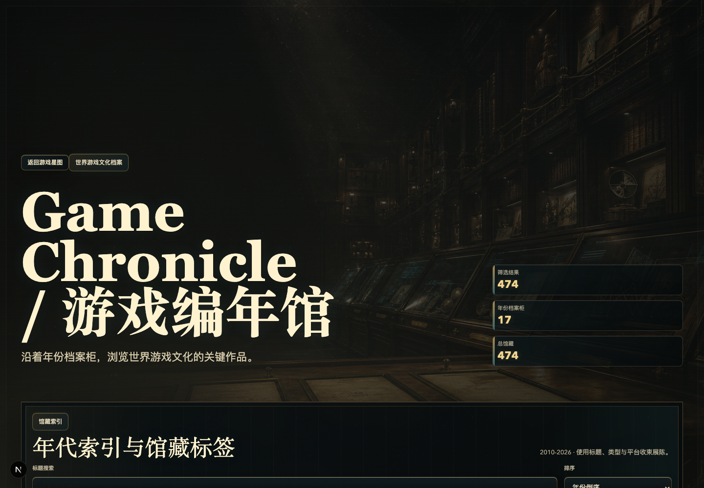

# Ludic Atlas / 游戏星图

Ludic Atlas / 游戏星图 是一个基于 Next.js、TypeScript 和 3D Globe 的游戏文化探索网站。它不是单纯的游戏列表，而是把游戏作为文化地理和时间档案来展示：用户可以从首页进入“游戏地球”，按国家/地区探索代表性游戏，也可以进入 Game Chronicle / 游戏编年馆，按年份浏览高分游戏和游戏档案。

这个项目适合作为个人作品集、课程项目、游戏文化可视化实验，或数字人文方向的前端原型。

> 数据边界说明：当前国家/地区归属并非官方结论，而是基于公开资料、开发商/发行商信息、RAWG 数据和本地推断流程整理的展示型数据，仅用于学习和展示。

## 项目预览

### 首页 / Hub



### 游戏地球 / 3D Globe



### 国家详情面板 / Country Detail Panel



### 游戏详情卡 / Game Detail Card



### 游戏编年馆 / Game Chronicle Archive



## 核心功能

- 3D 地球探索：基于 `react-globe.gl` 和 `three.js` 展示国家边界、游戏标记点、封面卡片和地球交互。
- 国家/地区游戏展示：点击国家后展示相关游戏数量、平均评分、代表性作品、主要类型和详情列表。
- 游戏编年馆：以时间轴方式浏览不同年份的游戏，结合年份卡片、筛选器和档案式信息展示。
- 游戏详情卡：展示封面、评分、类型、发行时间、开发商、发行商、平台和简介。
- 本地封面缓存：RAWG 封面可缓存到 `public/covers/rawg/`，减少远程图片不可用带来的展示问题。
- 静态数据生成：通过 `scripts/` 下的 Node.js 脚本生成或补充 `src/data/games.generated.ts`。
- 中文优先 UI：页面文案以中文体验为主，保留必要的英文项目名、模块名和游戏术语。

## 技术栈

- `Next.js`：App Router 页面入口和构建框架。
- `React`：组件化界面。
- `TypeScript`：类型约束和数据结构定义。
- `Tailwind CSS`：基础样式能力。
- `react-globe.gl`：3D 地球和地理交互。
- `three.js`：底层 WebGL / 3D 渲染能力。
- `RAWG API`：可选的游戏元数据来源。
- `Node.js scripts`：本地数据生成、封面缓存、国家/地区推断处理。
- `ESLint`：代码检查。

## 本地安装与打开方式

普通用户 clone 后不需要配置 RAWG API Key，也不需要重新抓取数据；直接安装依赖并启动开发服务器即可打开项目。

### macOS

前置条件：

- 安装 Node.js LTS，建议 Node.js 20 或以上。
- 安装 Git。
- 推荐使用 VS Code 或系统终端。

运行步骤：

```bash
git clone https://github.com/ChestnutleeEd/ludic-atlas.git
cd ludic-atlas
npm install
npm run dev
```

打开浏览器访问：

```text
http://localhost:3000
```

补充说明：

- 如果 `3000` 端口被占用，Next.js 可能会自动切换到 `3001`。
- 终端输出里会显示实际访问地址。
- 停止本地服务：在终端按 `Ctrl + C`。

### Windows

前置条件：

- 安装 Node.js LTS。
- 安装 Git for Windows。
- 推荐使用 PowerShell、Windows Terminal 或 VS Code Terminal。

运行步骤：

```powershell
git clone https://github.com/ChestnutleeEd/ludic-atlas.git
cd ludic-atlas
npm install
npm run dev
```

打开浏览器访问：

```text
http://localhost:3000
```

常见问题：

- 如果 PowerShell 不识别 `npm`，请重新打开终端，或检查 Node.js 是否安装成功。
- 如果端口被占用，请看终端提示打开 `3001` 或其他实际端口。
- 如果依赖安装很慢，可以更换网络或临时使用更稳定的 npm registry；本项目不会强制修改用户全局 npm 配置。

## 快捷打开方式

项目提供了一个更直观的本地启动别名：

```bash
npm run start:local
```

它和 `npm run dev` 一样会启动 Next.js 开发服务器。为了保证 macOS 和 Windows 都稳定，脚本不会自动强行打开浏览器；服务启动后手动访问：

```text
http://localhost:3000
```

## 数据说明

项目运行时读取的是本地静态数据和本地静态资源，浏览器端不会直接请求 RAWG API。

- `src/data/games.generated.ts`：前端直接使用的静态游戏数据入口。
- `data/rawg-details-cache.json`：RAWG 详情抓取缓存，用于减少重复请求。
- `data/country-inference-cache.json`：国家/地区推断缓存。
- `data/high-country-inference-review.json`：需要人工复核的高优先级推断结果。
- `public/covers/rawg/`：本地缓存的 RAWG 封面图片。
- `public/covers/fallback-game-cover.svg`：封面缺失时使用的 fallback 图。

只有在需要更新游戏数据或封面时，才需要配置 `.env.local` 和 RAWG API Key。`.env.local` 不应该提交到 GitHub。

## 数据更新流程（开发者可选）

如果你只是运行项目，可以跳过这一节。只有要重新生成 RAWG 数据、补充详情或更新封面缓存时，才需要执行这些步骤。

创建本地环境文件：

```bash
touch .env.local
```

写入 RAWG API Key：

```bash
RAWG_API_KEY=your_rawg_api_key
```

常用脚本：

```bash
npm run data:rawg
npm run data:covers
npm run data:enrich
npm run data:apply-countries
npm run data:infer-countries:dry
```

说明：

- `npm run data:rawg` 会生成或更新 RAWG 静态游戏数据。
- `npm run data:covers` 会把 RAWG 远程封面缓存到本地 `public/covers/rawg/`。
- `npm run data:enrich` 用于补充更完整的 RAWG 详情缓存。
- `npm run data:apply-countries` 会把已复核的高置信国家/地区推断结果应用到生成数据。
- `npm run data:infer-countries:dry` 用于本地 dry-run 推断检查，不会直接替代人工复核。

## 项目结构

```text
src/app                 Next.js 页面入口与全局样式
src/components          页面组件
src/components/globe    游戏地球相关组件
src/components/archive  游戏编年馆相关组件
src/components/panels   国家详情、游戏详情等侧边面板
src/data                前端使用的数据入口
src/lib                 数据处理、搜索、地理计算、封面处理等工具函数
src/types               TypeScript 类型定义
scripts                 数据抓取、国家推断、封面缓存等 Node.js 脚本
data                    本地生成的数据缓存与复核文件
public/covers           项目使用的本地封面资源
docs                    项目文档和 README 图片资源
```

## 常用命令

```bash
npm run dev
npm run start:local
npm run lint
npm run build
npm run typecheck
npm run data:rawg
npm run data:covers
```

## 灵感来源

游戏地球部分的交互参考了 Movie Globe 这类“通过世界地图探索媒介内容”的产品逻辑，包括地理分组、封面标记、悬停预览和详情面板。Ludic Atlas 将这个方向改造为全球游戏文化探索，而不是电影浏览。

游戏地球部分的概念灵感，部分来自小红书博主「麻省理工 Rui同学」关于用 AI 体验世界人文的内容方向。本项目仅作为个人学习、课程展示与作品集实践，不代表该博主参与、授权或背书本项目。

## Roadmap / 后续计划

- 优化 3D 地球性能和移动端体验。
- 增加更多国家/地区与游戏样本。
- 优化国家归属推断逻辑，引入更明确的人工复核标记。
- 增加更多游戏文化维度，例如类型、主题、发行年代、开发者网络。
- 优化游戏编年馆的筛选、动画和叙事体验。
- 后续考虑接入更高质量的封面或元数据来源。

## 仓库地址

[https://github.com/ChestnutleeEd/ludic-atlas](https://github.com/ChestnutleeEd/ludic-atlas)

## License

No license has been selected yet.
