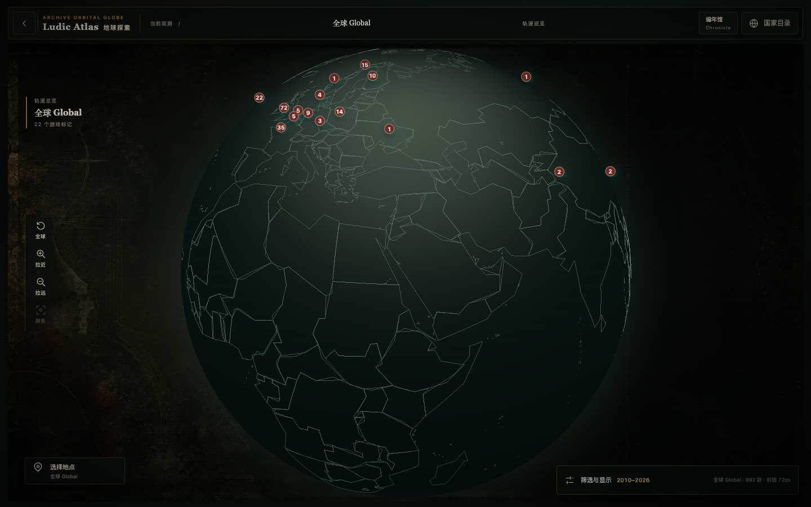
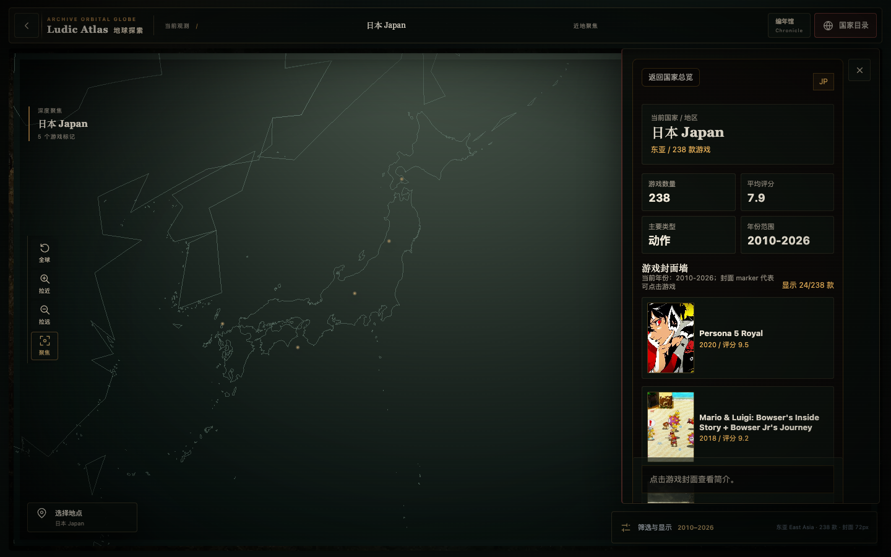
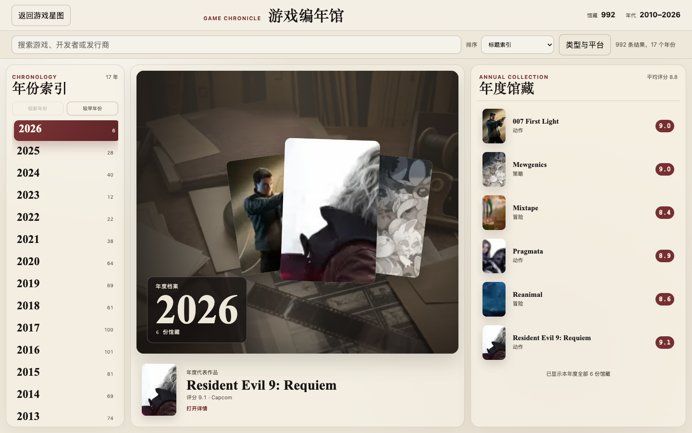

# Ludic Atlas / 游戏星图

> A spatial and chronological atlas of global game culture.
> 一座从地理与时间两个维度探索全球游戏文化的互动星图。

Ludic Atlas / 游戏星图是一项课程作品与可运行的 Web MVP。它不把游戏仅仅排列成榜单，而是将作品放回开发工作室所在的国家或地区、发行年代和媒介文化中，邀请用户沿着地球与时间线发现游戏。

本项目是基于 Next.js 的本地 Web 应用，不是原生桌面应用，也不是完全免安装程序。运行现有内容需要 **Node.js 20 或更高版本**；普通浏览不需要配置 RAWG API Key。

## 项目理念

- **空间也是索引**：以主要开发商 / 工作室所在国家或地区组织代表性游戏，观察不同地方的产业与创作脉络。
- **时间也是展厅**：用编年馆串联 2010–2026 年的游戏档案，让同一批数据呈现出另一种叙事。
- **本地数据优先**：浏览器只读取仓库中的静态数据、地理边界和封面，课程展示不依赖后端数据库。
- **探索胜过排名**：评分用于筛选和辅助发现，不把文化价值简化成单一排行榜。

## 三个主要界面

### Landing Hub / 星图入口

单屏入口同时呈现 Earth Explorer 与 Game Chronicle。地球探索是主要视觉入口，编年馆则提供独立、完整的时间维度入口。


### Earth Explorer / 地球探索

在可旋转、缩放的 3D 地球上查看国家边界、国家聚合点和代表性游戏封面；可以按区域或国家聚焦，并在右侧面板继续查看国家与游戏详情。





### Game Chronicle / 游戏编年馆

按年份浏览本地游戏档案，结合年度封面、馆藏列表、搜索、类型 / 平台筛选和游戏档案抽屉，形成与地球视图互补的时间线体验。



## 核心功能

- 按国家与地区探索代表性游戏
- 3D 地球旋转、滚轮缩放、区域预设和国家聚焦
- 国家目录、国家统计、国家详情与游戏详情
- 发行年份筛选和评分范围筛选
- 国家聚合标记与游戏封面显示模式
- 48–112 px 封面尺寸控制，默认 72 px、步进 4 px
- Game Chronicle 年份索引、搜索、类型 / 平台筛选和评分优先排序
- 桌面与移动端自适应界面，以及键盘和减少动态效果支持

### 最新交互改进

- 旋转地球、滚轮缩放、自动旋转和国家镜头飞行期间，已接受的游戏封面布局会持续显示并保持贴合地表。
- 交互期间只降低阴影、动画、提示等非必要效果，避免封面消失或重新加载造成的闪烁。
- 封面高度统一为 48–112 px 的直接控制区间，并保存最近一次有效设置。

## 技术栈

- Next.js App Router、React、TypeScript
- Tailwind CSS、CSS Modules
- Three.js、`react-globe.gl`
- Motion、GSAP
- Node.js 本地数据与发布脚本
- Playwright 浏览器回归与截图验证
- ESLint、TypeScript、Node Test Runner

## 数据来源与本地数据

当前游戏目录基于 RAWG 数据生成，并结合项目内维护的国家 / 地区推断；国家映射以主要开发商或工作室所在国家或地区为准，不代表官方分类。生成后的游戏记录、地理数据和绝大多数封面均已保存在仓库内：

- `src/data/games.generated.ts`：生成后的静态游戏记录
- `src/data/games.mock.ts`：稳定的本地后备数据
- `public/covers/rawg/`：本地缓存封面
- `public/data/earth-lod/`：地球边界分级数据

浏览现有内容时，页面不会直接请求 RAWG API，也不需要用户设置 `RAWG_API_KEY`。只有开发者重新抓取 RAWG 数据时才需要自行准备 `.env.local` 与 API Key；这些文件不会进入课程发布包。

## 快速启动

### Windows

1. 安装 Node.js 20 或更高版本，并确认安装时包含 npm。
2. 解压课程发布 ZIP。
3. 双击 `start-windows.cmd`。
4. 第一次启动时脚本会自动执行 `npm ci` 安装依赖；之后只要 `node_modules` 仍存在，就不会重复安装。
5. 脚本构建项目、启动本地服务，并自动打开 `http://localhost:3000`。

若 npm 官方源安装失败，脚本会询问是否仅为本次命令使用 `https://registry.npmmirror.com` 重试，不会修改全局 npm 配置。出现错误时窗口会保留并显示原因。

### macOS

1. 安装 Node.js 20 或更高版本，并确认安装时包含 npm。
2. 解压课程发布 ZIP。
3. 首次运行如遇到权限提示，在“终端”进入项目目录后执行：

   ```bash
   chmod +x start-macos.command
   ```

4. 双击 `start-macos.command`，或在终端运行 `./start-macos.command`。
5. 第一次启动时脚本会自动执行 `npm ci`；后续不会重复安装。随后脚本会构建、启动服务并打开 `http://localhost:3000`。

macOS 可能提示这是从互联网下载的未签名脚本。请确认文件来自本项目 Release 后，在“系统设置 → 隐私与安全性”中允许打开，或通过终端运行。镜像重试同样只作用于当前 `npm ci` 命令。

两个脚本都只检查环境，不会自动下载或安装 Node.js。

## 开发者安装

```bash
git clone https://github.com/ChestnutleeEd/ludic-atlas.git
cd ludic-atlas
node --version   # 必须为 v20 或更高
npm ci
npm run dev
```

访问 `http://localhost:3000`。生产模式与便捷脚本一致：

```bash
npm run build
npm run start
```

常用验证命令：

```bash
npm run lint
npm run typecheck
npm test
npm run build
```

创建课程发布包：

```bash
npm run release:course
```

产物位于 `dist-release/Ludic-Atlas-Course-Edition.zip`，校验文件位于 `dist-release/SHA256SUMS.txt`。

## 项目目录

```text
src/app/                  Next.js 路由、页面布局与全局样式
src/components/home/      Landing Hub
src/components/globe/     3D 地球、边界、封面标记与提示
src/components/archive/   Game Chronicle 时间线与档案界面
src/components/panels/    国家目录、国家详情与游戏详情
src/components/controls/  年份、评分、封面和相机控制
src/data/                 静态游戏与国家数据入口
src/lib/                  筛选、统计、地理、相机与布局逻辑
src/types/                TypeScript 数据契约
public/                   本地封面、地理数据和界面素材
scripts/                  数据处理与课程发布脚本
tests/                    单元测试与 Playwright 回归测试
docs/                     产品、架构、数据与发布文档
```

## 常见问题

### 是否需要 RAWG API Key？

不需要。课程包已包含浏览现有内容所需的主要数据和封面。只有重新抓取 RAWG 数据的开发工作才需要 API Key。

### 为什么第一次启动较慢？

第一次启动需要联网执行 `npm ci`，随后还要完成 Next.js 生产构建。依赖目录保留后，后续启动不会重复安装，但仍会按发布脚本要求重新构建。

### 官方 npm 源安装失败怎么办？

便捷脚本会询问是否使用 npmmirror 仅重试本次安装。它使用 `--registry` 参数，不会改写用户的全局 npm registry。

### 浏览器没有自动打开怎么办？

确认终端显示服务已启动，然后手动访问 `http://localhost:3000`。如果端口 3000 被占用，请先停止占用该端口的程序再运行脚本。

### macOS 为什么阻止脚本？

课程包中的 `.command` 文件未进行 Apple 代码签名或公证。确认下载来源后，可按上方 macOS 步骤授权或从终端运行。

### 可以完全离线使用吗？

依赖安装完成后，主要浏览数据与封面来自本地；但第一次执行 `npm ci` 仍需要访问 npm registry。

## 已知限制

- 这是课程用途的 Web MVP，不是原生桌面应用或完全免安装程序。
- 必须由用户预先安装 Node.js 20+ 与 npm。
- 启动脚本未进行 Windows 代码签名或 Apple 公证。
- 国家 / 地区归属来自项目级推断，跨国协作作品被简化为一个主要地区。
- 数据集不是完整商业游戏数据库；部分记录、中文标题、封面或地区信息可能缺失。
- 当前正式探索器仅提供 3D Globe；规划中的 2D/2.5D Atlas 尚未作为产品功能开放。

## License

本仓库当前未附带开放源代码许可证。除法律另有规定外，代码、文档与素材的权利由各自权利人保留；第三方游戏名称、商标和封面归其权利人所有。若需复用或再发布，请先取得相应授权。

---

**English summary:** Ludic Atlas is a course-project Web MVP for exploring game culture by geography and chronology. It includes a 3D Earth Explorer, country and year filters, persistent cover markers during globe interaction, a 48–112 px cover-size control, and a Game Chronicle. Node.js 20+ and npm are required; the first launch installs dependencies, while existing browsing data and most covers are local and require no RAWG API Key.
